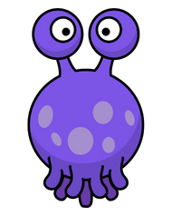

# A little bit better every day!
  Trying to be better programmer and ethical hacker. A little bit better every day. Daily challenges and exercises. Mostly coding exercises but this repository has cracked machine solutions (some manuals how to crack them) for HTB and TryHackMe and more. Some small projects which can improve my programming and engineering skills. You can use this repository as an example for your journey if you want! Feel free to contribute more exercises, sites and programs for developing more!

Exercises List  
-Leetcode  
-HTB  
-TryHackMe  
-HackerOne  
-BugBounty  
-HTB Academy  

**HTB Academy**
_**Certificates (Click on the certificates to verify and see more details):**_   

_in progress_

_**Badges (Click on the badges to verify and see more details):**_   
<table>
  <tr>
<td align="center">

      
<strong>Crawl, walk, run</strong>

      
For completing the Windows Fundamentals module

</td>
<td align="center">

      
<strong>Dive into requests</strong>

      
For completing the Using Web Proxies module

</td>
<td align="center">

      
<strong>Everything is connected</strong>

      
For completing the Introduction to Networking module

</td>
    <td align="center">

      
<strong>First things first</strong>

      
For completing the Operating System Fundamentals path

</td>
    <td align="center">

      
<strong>Fuzzing is power</strong>

      
For completing the Attacking Web Applications with Ffuf module

</td>
  </tr>
  <tr>
<td align="center">

      
<strong>Information is not knowledge, or is it?</strong>

      
For completing the Information Gathering - Web Edition module

</td>
<td align="center">

      
<strong>Our favorite seabird</strong>

      
For completing the Linux Fundamentals module

</td>
<td align="center">

      
<strong>Philomath</strong>

      
For completing the Learning Process module

</td>
    <td align="center">

      
<strong>Playing with the mess</strong>

      
For completing the JavaScript Deobfuscation module

</td>
    <td align="center">

      
<strong>Your request is my demand</strong>

      
For completing the Web Requests module

</td>
  </tr>
    <tr>
<td align="center">

      
<strong>Developer</strong>

      
For completing the Introduction to Web Applications module

</td>
  </tr>
</table>

**LetsDefend**   
_**Certificates (Click on the links to verify and see more details):**_   
-SOC Analyst Certification    ( https://app.letsdefend.io/certificate/show/ae864c32-3430-4653-b7f4-4075754dd1df )

-Malware Analysis Certificate    (https://app.letsdefend.io/certificate/show/50ad9133-09e8-41c1-98fa-a47a47b515c7 )
   

_**Badges (Click on the badges to verify and see more details):**_   

<table>
  <tr>
<td align="center">

      
<strong>Phishing Expert</strong>

      
Tuğcan Topaloğlu has completed the "Phishing Campaign Analysis" course

</td>
<td align="center">

      
<strong>Cyber Kill Chain</strong>

      
Tuğcan Topaloğlu has completed the "Cyber Kill Chain" course

</td>
<td align="center">

      
<strong>Dynamic Analyst</strong>

      
Tuğcan Topaloğlu has completed the "Dynamic Malware Analysis" course

</td>
    <td align="center">

      
<strong>Lab Builder</strong>

      
Tuğcan Topaloğlu has completed the "Building a Malware Analysis Lab" course

</td>
    <td align="center">

      
<strong>Office Document Analyzer</strong>

      
Tuğcan Topaloğlu has completed the "Malicious Document Analysis" course

</td>
  </tr>
  <tr>
<td align="center">

      
<strong>Malware Analyzer</strong>

      
Tuğcan Topaloğlu has completed the "Malware Analysis Fundamentals" course

</td>
<td align="center">

      
<strong>Malware Analysis Skill Path</strong>

      
Tuğcan Topaloğlu has completed the "Malware Analysis" skill path

</td>
<td align="center">

      
<strong>MITRE ATT&CK</strong>

      
Tuğcan Topaloğlu has completed the "MITRE ATT&CK Framework" course

</td>
    <td align="center">

      
<strong>Network Cable</strong>

      
Tuğcan Topaloğlu has completed the "Network Fundamentals" course

</td>
    <td align="center">

      
<strong>Phishing Analyzer</strong>

      
Tuğcan Topaloğlu has completed the "Phishing Email" challenge

</td>
  </tr>
    <tr>
<td align="center">

      
<strong>Detector</strong>

      
Tuğcan Topaloğlu has completed the "Port Scan Activity" challenge

</td>
<td align="center">

      
<strong>PowerShell Script</strong>

      
Tuğcan Topaloğlu has completed the "PowerShell Script" challenge

</td>
<td align="center">

      
<strong>Reverser - 2</strong>

      
Tuğcan Topaloğlu has completed the "Reverse Engineering - 2" course

</td>
    <td align="center">

      
<strong>Reverser</strong>

      
Tuğcan Topaloğlu has completed the "Reverse Engineering" course

</td>
    <td align="center">

      
<strong>Shocker</strong>

      
Tuğcan Topaloğlu has completed the "Shellshock Attack" challenge

</td>
  </tr>
      <tr>
<td align="center">

      
<strong>SOC Member</strong>

      
Tuğcan Topaloğlu has completed the SOC Fundamentals course

</td>
<td align="center">

      
<strong>VirusTotal</strong>

      
Tuğcan Topaloğlu has completed the "VirusTotal for SOC Analysts" course

</td>
<td align="center">

      
<strong>Reverser - 2</strong>

      
Tuğcan Topaloğlu has completed the "Reverse Engineering - 2" course

</td>
    <td align="center">

      
<strong>Web Attack Investigated</strong>

      
Tuğcan Topaloğlu has completed the "Investigate Web Attack" challenge

</td>
    <td align="center">

      
<strong>Wireshark Expert</strong>

      
Tuğcan Topaloğlu has completed the "Malware Traffic Analysis with Wireshark" course

</td>
  </tr>
        <tr>
<td align="center">

      
<strong>First Blood</strong>

      
Tuğcan Topaloğlu has completely investigated the first incident.

</td>
          <td align="center">

      
<strong>Incident Handler</strong>

      
Tuğcan Topaloğlu has completely investigated 5 different incidents.

</td>
                    <td align="center">

      
<strong>Web Attack Investigator</strong>

      
Tuğcan Topaloğlu has completed the "Investigating Web Attacks as SOC Analyst" course.

</td>
                    <td align="center">

      
<strong>Web Hunter</strong>

      
Tuğcan Topaloğlu has completed the "Detecting Web Attacks - 2" course.

</td>
<td align="center">

      
<strong>MSHTML Analyzer</strong>

      
Tuğcan Topaloğlu has completed the "MSHTML" challenge.

</td>
  </tr>
    </tr>
        <tr>
          <td align="center">

      
<strong>Incident Handler</strong>

      
Tuğcan Topaloğlu has completed the "IT Security Basis for Corporates" course.

</td>
          <td align="center">

      
<strong>Network Analyzer</strong>

      
Tuğcan Topaloğlu has completed the "Network Analysis" course.

</td>
          <td align="center">

      
<strong>SIEM 101</strong>

      
Tuğcan Topaloğlu has completed the SIEM 101 course.

</td>
                    <td align="center">

      
<strong>Incident Handler - 2</strong>

      
Tuğcan Topaloğlu has completely investigated 10 different incidents

</td>
                    <td align="center">

      
<strong>Lab Builder</strong>

      
Tuğcan Topaloğlu has completed the "Building a SOC Lab at Home" course

</td>
  </tr>
          <tr>
          <td align="center">

      
<strong>Threat Analyst</strong>

      
Tuğcan Topaloğlu has completed the "Cyber Threat Intelligence" course.

</td>
          <td align="center">

      
<strong>Security Solutions</strong>

      
Tuğcan Topaloğlu has completed the "Security Solutions" course.

</td>
          <td align="center">

      
<strong>Brute Force</strong>

      
Tuğcan Topaloğlu has completed the "Detecting Brute Force Attacks" course.

</td>
                    <td align="center">

      
<strong>SOC Analyst Learning Path</strong>

      
Tuğcan Topaloğlu has completed the "SOC Analyst Learning Path".

</td>
                    <td align="center">

      
<strong>Splunk Engineer</strong>

      
Tuğcan Topaloğlu has completed the "Splunk" course.

</td>
  </tr>
            <tr>
          <td align="center">

      
<strong>Incident Management</strong>

      
Tuğcan Topaloğlu has completed the "Incident Management 101" course.

</td>
<td align="center">

      
<strong>Reporter</strong>

      
Tuğcan Topaloğlu has completed the "Writing a Report on Security Incident" course.

</td>
  </tr>
</table>

**TryHackMe**
_**Certificates (Click on the certificates to verify and see more details):**_   

_in progress_

_**Badges (Click on the badges to verify and see more details):**_   

_in progress_
